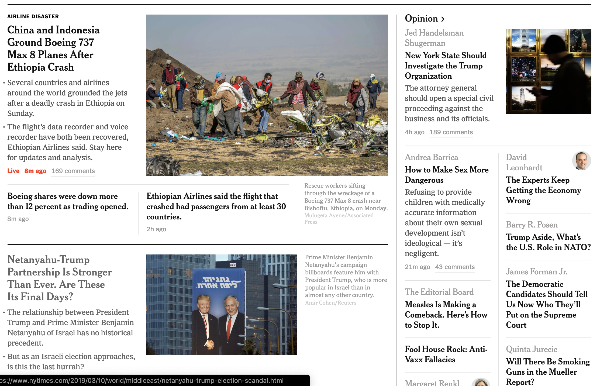

# 1.2 How is content perceived?

While there are [many types of assistive technology](https://webaccess.berkeley.edu/resources/assistive-technology), we will focus on screen readers which communicates the structure and content of web pages via simulated speech or a Braille readout. Many of the best practices that will allow your content to be read via a screen reader will also help with other assistive technologies.

## Try this experiment

Look at the [_New York Times_ website](https://www.nytimes.com) and think aloud about what you are looking at as you go through the homepage. 



What are you reading to understand the page? Are you reading every word on the page? Are you skimming the headlines? Looking at the photos? The navigation? Which methods help you understand the page the easiest and/or fastest? 

The answer, accordingly to [eye-tracking studies](https://www.nngroup.com/articles/f-shaped-pattern-reading-web-content/), is that we do not read every word, but rather we skim pages looking for content that interests or serves us best. In that scan we take in things like headings and key text such as phone numbers.

A person can use a screen reader in much a similar manner as they aim to understand the structure and content of a webpage. Just as we visually scan for headlines, a screen reader can accomplish the same by reading the page headings, links, and regions of the page \(such as the navigation and main content\). 

But what would happen if the computer had no way of telling which is which? That is where you, as the content creator, can help.

## Making the web visible to a screen reader

Screen readers cannot communicate page content and structure based on what can only be seen by eye. Rather, they rely on how our page is coded and organized. If not done properly, content can go missing or its intent lost.

For example, a screen reader relies on headings coded into the page to communicate article headlines or section titles within an article. For example, `<h1>` is for a top level heading, `<h2>` for second level, etc.

With our headline labeled as a heading, our screen reader can indeed see it as a headline. 

```markup
<h2>Article headline</h2>
<p>This is the first paragraph of content.</p>
```

On the other hand, what if we only make the words bold? It will stand out visually, but a screen reader has no means of knowing if we intend for this text to be a headline or simply emphasized.

```markup
<p><strong>These words are bold, but is it a headline?</strong></p>
<p>This is the first paragraph of the article.</p>
```

When used correctly, our website management software, such as LibGuides or Wordpress, can handle most of these simple coding needs. However, as we write content within them, we can still introduce many errors. These errors, in turn, can make reading the pages with a screen reader difficult at best.

## Read more...

* [How People with Disabilities Use the Web](https://www.w3.org/WAI/people-use-web/)
* [I Used The Web For A Day Using A Screen Reader](https://www.smashingmagazine.com/2018/12/voiceover-screen-reader-web-apps/)

### **Simulations from WebAIM**

* [Screen reader Simulation](https://webaim.org/simulations/screenreader)
* [Low-vision Simulation](https://webaim.org/simulations/lowvision)
* [Dyslexia Simulation](https://webaim.org/simulations/dyslexia)
* [Distractability Simulation](https://webaim.org/simulations/distractability)

