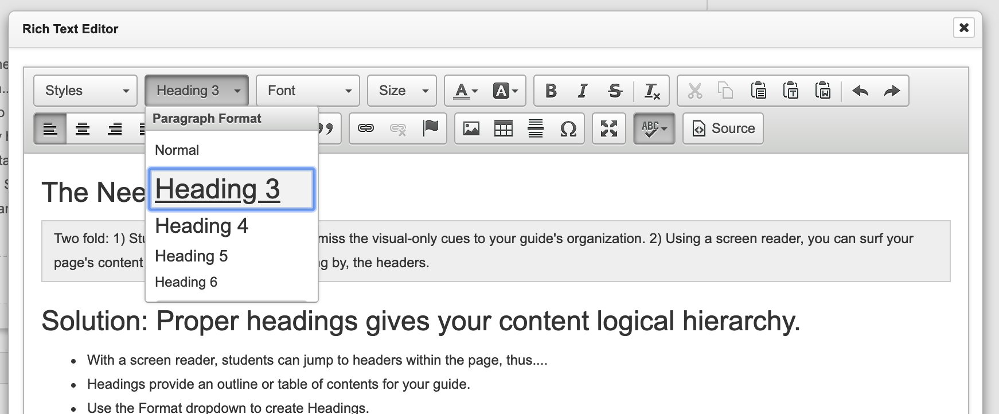

# Headers

## Screen reader interaction


* Students can quickly skim the contents of our page by listening to the page headings. 
* They can also jump to those points on the page. 
* You page will be described in a linear fashion so we cannot rely entirely on visual organization. Thus, even our three-column pages are heard as a single column starting with the first column. 


## Solution: Headings give your content logical hierarchy. 

Use page headings to outline your content— not unlike a bulleted page outline or table of contents. Use the headings in order and don't skip headings.

In LibGuides, Heading 1 `<h1>` is reserved for guide titles and Heading 2 `<h2>` is held for box titles. For the content within the boxes, we are using headings 3 to 6. Here's an example of how to keep headings in good order.

* **H1 Guide Title**
  * **H2 Box Title**
    * H3 Section inside a box
      * H4 Sub-section inside a box
      * H4 Sub-section
    * H3 Section
  * **H2 Box Title**
    * H3 Section
    * H3 Section
      * H4 sub-section
      * H4 sub-section

### How to use headings in LibGuides

1. Click in the paragraph you want to be a header
2. Select the level of heading from the paragraph format menu \(pictured above\). 

### Additional best practices

* Don't use a font-size change alone to signify headings. This heading would be missed by a screen reader.
* Similarly, don't change the headings to simply make text larger or smaller. This can alter your page outline and make it difficult to understand.
* If you need to change the heading's font size, do so after making it a heading.

## Testing

### Using Tota11y

* When you click the Tota11y icon and select the headings button, a window will pop up explaining any errors. The most common errors are headings skipped and headings out of order. 
* This window also has a summary tab \(above\) which shows the sequential and nesting order of your headings. It is easy to see where errors may occur and if your nesting order makes sense.
* On your page, you will also see small heading notations next to each header so you can see which elements on the page are headings.

### Fix a mistagged heading

Just as you click in a paragraph and change it to a heading from the paragraph format menu, you can also repair headings in the same manner. Simply click the heading and select the proper level from the menu.

In rare instances, you'll find a heading accidentally tagged a subsequent paragraph. You can reset the non-heading to normal with the same menu.

### **Check your page on your cellphone**

Another way to visualize the organization of your page is to view it with a phone browser. Your content will become linear in much the same way it does on a screen reader. If the page does not make sense on a phone, a re-ordering of content will be needed.

