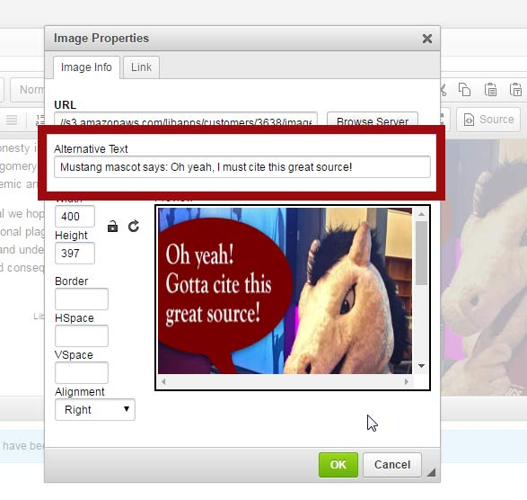

# 2.2 Images

## The Interaction


Students using a screen reader will hear the alternative text \(also known as "alt text"\) read aloud when encountering an image on a webpage. Without alt-text, the images become invisible to the reader.


## Solution: Use Alternative Text to describe your images

Screen readers will read alt text in the place of the image to convey its intended meaning. 

### What should be included in the alt text?

* All information related to the image’s content and function.
* Keep it brief. If brief is not possible, consider including more explanation in your text.
* You can skip introductory phrases such as "image of...." as the screen reader will announce it is an image by default.

### Alt text is not needed when...

* Graphics are purely decorative.
* Alt text would be repetitive information.
  * For example, the alt text for a book cover might be its title. If the image is next to a catalog link that also features the title, the alt text become redundant.
* In these cases we still need an alt tag, but it would be empty: 
  * ``

### How to add alt-text in LibGuides

The image properties tool in LibGuides \(below\) provides a space where users can easily insert the description of an image when it is inserted or edited. WordPress and other CMS have similar dialog boxes where alt text can be entered.

## Testing

* Click "Image alt-text" in Tota11y.
* The error window will report if there are any images requiring alt text.
* Next to the error message you'll see a small magnifying glass. You can click this icon to see which image caused the error.
* Accessibility testing requires human verification. 
  * For example, an "empty" alt tag `alt=""` is used for decorative images. This often comes up as an error in accessibility tests. If the image is indeed decorative, don't worry about the error.

## Read more...

For best practices on creating alternative text, please consult the links below.

* [WebAIM Alternative Text Guide](http://webaim.org/techniques/alttext/)
* [Image ALT Tag Tips from Penn State](http://accessibility.psu.edu/images): Gives helpful examples of Alt Text descriptions for different situations.

