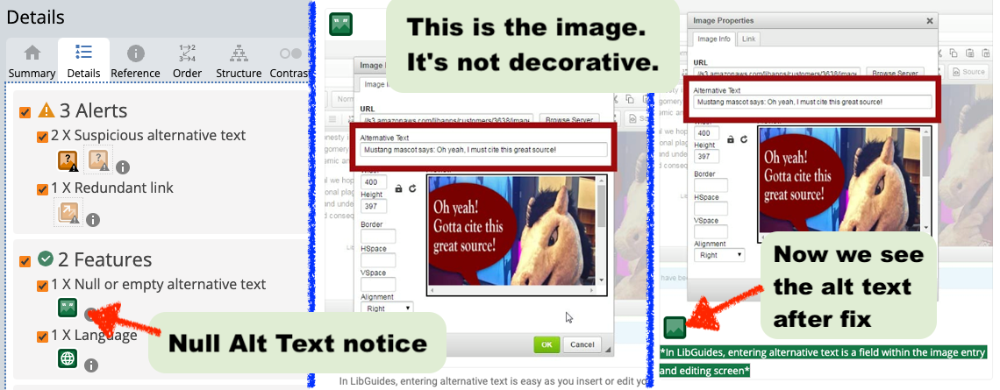

# 2.2 Images

## Screen Reader Interaction


Patrons using a screen reader will hear the alternative text (also known as "alt text") read aloud when encountering an image on a webpage. Without alt-text, the images become invisible to the reader.


## The Solution: Use Alternative Text to describe your images

Screen readers will read alt text in the place of the image to convey its intended meaning.&#x20;

### What should be included in the alt text?

* Information related to the image’s content, function, and intent.
* Keep it brief. If brief is not possible, consider including more explanation in your text.
* Skip introductory phrases such as "image of...." as the screen reader will announce it is an image by default.
* Some content management systems allow for image captions. If the image caption and alt text would be exactly the same, a caption alone would suffice. However, ideally you describe the image itself in the alternative text and use the captions for adding additional context or meaning for the image.&#x20;

### Alt text is not needed when...

* Graphics are purely decorative.
* Alt text would be repetitive information.
  * For example, the alt text for a book cover might be its title. If the image is next to a catalog link that also features the title, the alt text become redundant.
* In these cases we still need an alt tag, but it would be empty:&#x20;
  * ``

### Video tutorial


Learn about alternative text and why it is important for people who cannot see photographs and graphic images. From the ADA National Network.


### How to add alt-text in LibGuides

The image properties tool in LibGuides (below) provides a space where users can easily insert the description of an image when it is inserted or edited. Drupal, WordPress, and other CMS have similar dialog boxes where alt text can be entered.

<figure><figcaption></figcaption></figure>

## Testing

* Activate the WAVE tool and click on the "Details" tab.
* Look through the Error, Alert, and Feature categories and review all alternative text comments. Click on the icons with each message to bring up the relevant image on your website.
* Use the messages to double check that all your images have appropriate alt text. The alternative text will listed with each image.
* In the series of screenshots below, the Details tab mentions an image with a "Null or empty alternative text" (left). However, looking at the actual image (center), we can see it is not a decorative image and thus should have alternative text. We should enter that information and test again to see the new alt text highlighted (right).

<figure><figcaption></figcaption></figure>

## Read more...

For best practices on creating alternative text, please consult the links below.

* [WebAIM Alternative Text Guide](http://webaim.org/techniques/alttext/)
* [Image ALT Tag Tips from Penn State](http://accessibility.psu.edu/images): Gives helpful examples of Alt Text descriptions for different situations.
* [The Diagram Center Image Description Guide](https://diagramcenter.org/making-images-accessible.html): Fabulous website for learning to describe advanced graphics such as comics or data visualizations.
