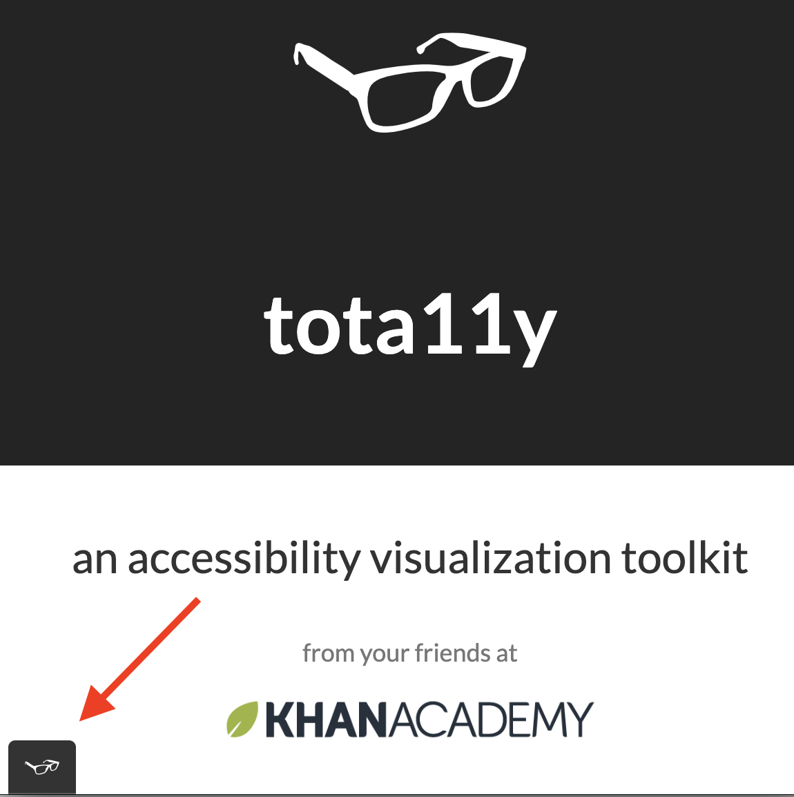

# Let's install a simple accessibility testing tool

In the next section, we'll outline strategies for creating accessible content. As you create this material, try this simple tool for double checking your work \(and also to examine older content for accessibility upgrades\). 

## Tota11y accessibility visualization tool

\*\*\*\*[**Tota11y**](http://khan.github.io/tota11y/) is a bookmarklet created by the Kahn Academy to help you visualize how your content is perceived by screen readers and other assistive technology. 

### Installation method 1: bookmarklet 

Do you keep a bookmarks bar visible? Simply click and hold the Tota11y link below, then drag the link from the box below into your bookmarks bar. To activate the tool, simply click the bookmark.


\*\*\*\*[**tota11y**](javascript:%28function%28%29{var%20tota11y=document.createElement%28'SCRIPT'%29;tota11y.type='text/javascript';tota11y.src='https://khan.github.io/tota11y/tota11y/build/tota11y.min.js';document.getElementsByTagName%28'head'%29[0].appendChild%28tota11y%29;}%29%28%29;)\*\*\*\*


### Installation method 2: Chrome extension

[Tota11y is also available as a Chrome extension](https://chrome.google.com/webstore/detail/tota11y-plugin-from-khan/oedofneiplgibimfkccchnimiadcmhpe/related). Install the extension, then click the eyeglasses icon in your toolbar to activate.

### Using Tota11y

1. Go to the page you wish to evaluate
2. Either click the Tota11y bookmark you just installed \(or the Chrome extention icon\).
3. Click the black x-ray glasses icon which will now appear at the bottom left corner of your page \(screenshot above\).
4. You'll see a pop-up menu with choices such as Headers, Contrast, and Image alt-text. 
5. Clicking one of these options will provide information and screen annotations and track any errors.
6. Clicking the option a second time dismisses the report.
7. Clicking the glasses again minimizes the tool.

We will review these tools on the following pages as we talk about how to create better content.

## Next: How to build better...

In our next set of pages, we will go into more details on how assistive technologies access our pages, then provide examples and tips for how you can make powerful contributions to making your content universally accessible.

